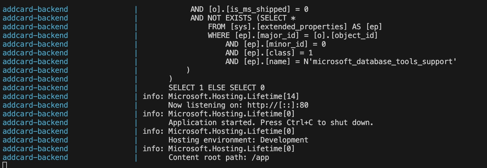
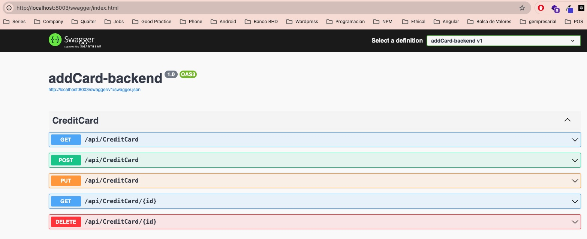

# Brief description

This api was build in order to show case knowlege of using backend (.net core). This api includes a Dockerized SQL Server instance by default, once is already installed you can interact with the database without issues.

# How to Install

- install Docker Desktop
- After successfully installing Docker Desktop, run these commands in a terminal:
  - `docker-compose build`
  - `docker-compose up`

it should look like this:

Then your project on localhost:8003/swagger/index.html

